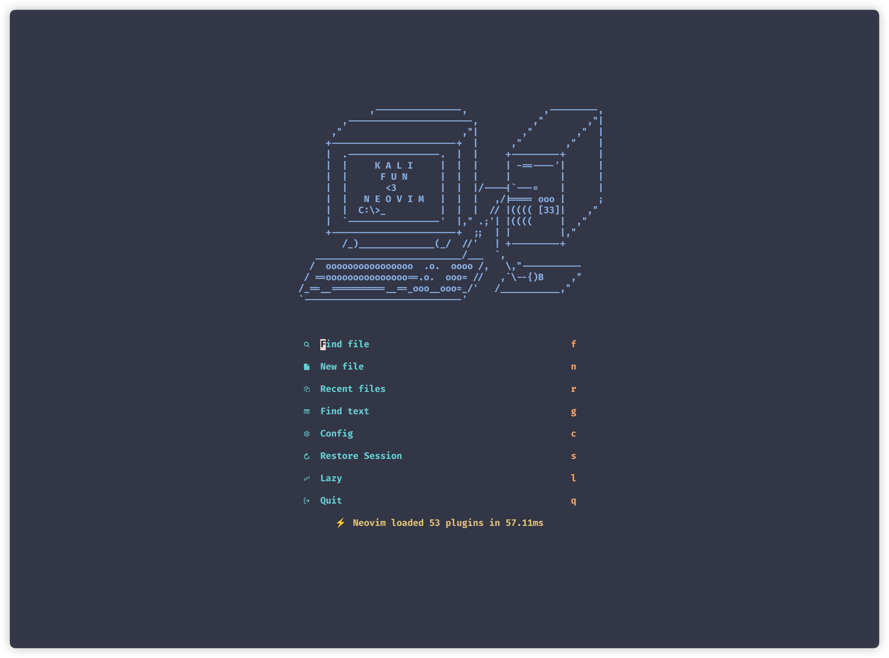
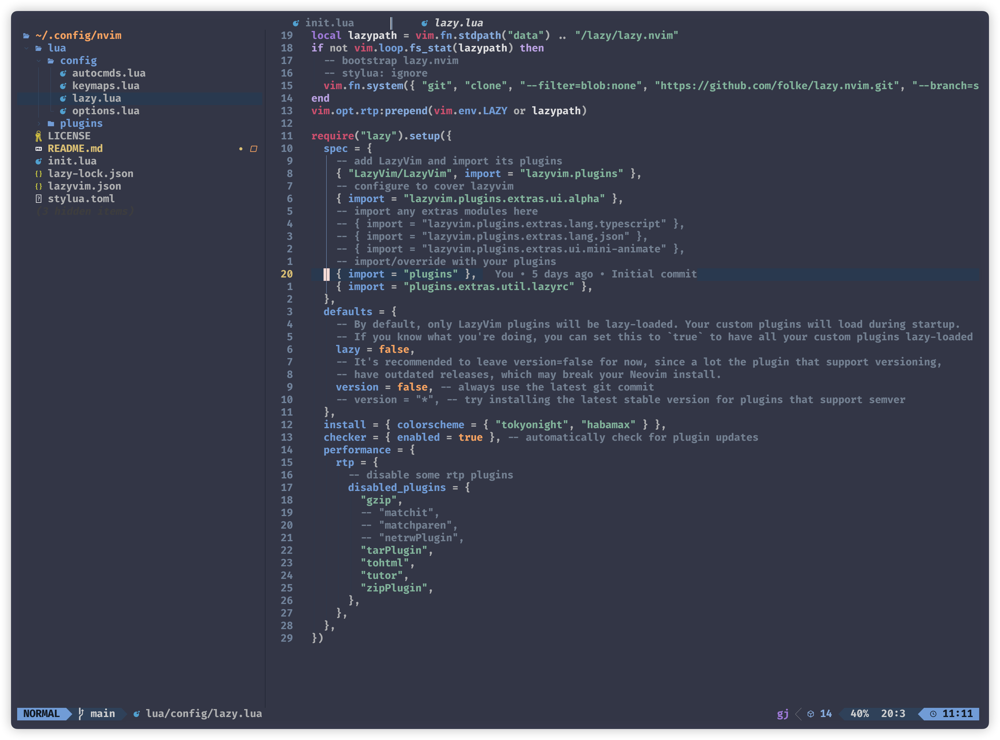

# neovim settings

> A starter template for [LazyVim](https://github.com/LazyVim/LazyVim).
Refer to the [documentation](https://lazyvim.github.io/installation) to get started.

## Start 

Clone the git repo `git clone https://github.com/kalifun/nvim ~/.config/nvim`

## Screenshots

### dashboard

### editor

## Thank

Some code comes from [Nv](https://github.com/appelgriebsch/Nv)
